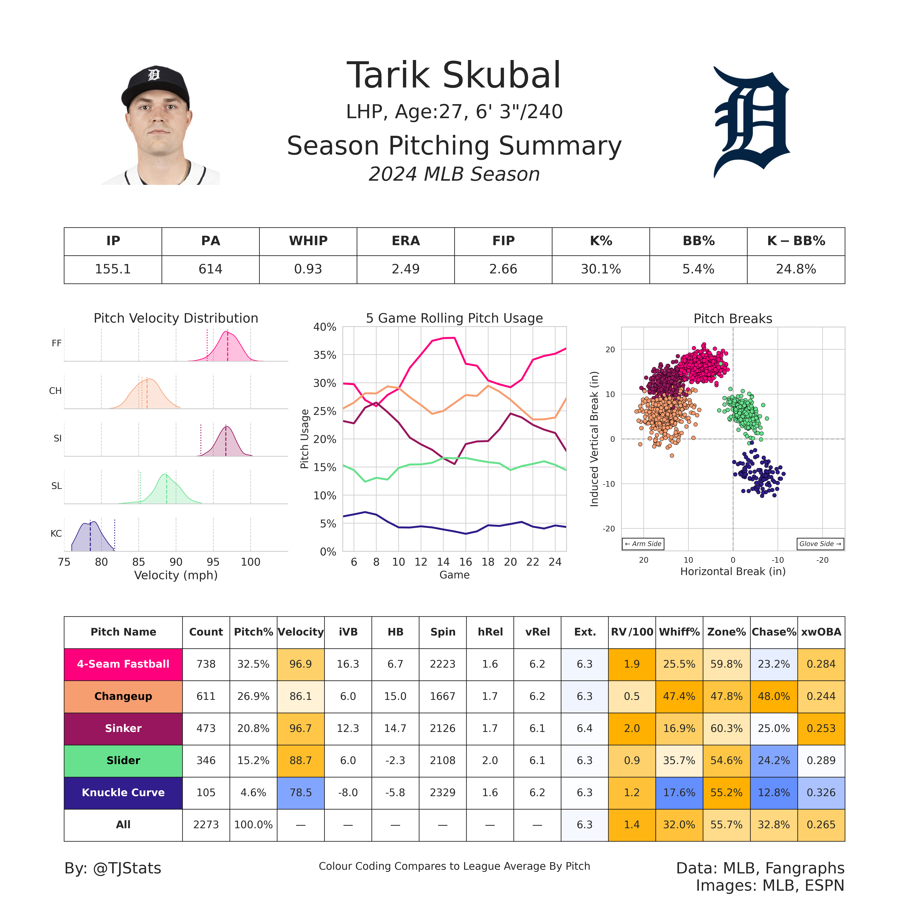

## Pitching Summary Graphic

This is a project which contains the code which generates my popular "TJStats" Pitching Summaries.
I wanted to make my code public because I believe it is the best way get others interested in baseball data analytics and inject new insights into an already supportive and thriving community.
Please make any changes you would like to this code. I intend for this notebook to be a framework and help inspire others in their journey within the baseball analytics sphere.
Please let me know if you have any questions!

Here is an example output for the project:



## Article
Please refer to both the .IPYNB file and the accompanying article  for my methodology and all code associated with the project.

## Requirements
#### *Versions and Packages*
```
Python 3.9.13
```
```
pandas==1.5.2
numpy==1.23.5
seaborn==0.11.1
pybaseball==2.2.7
matplotlib==3.5.1
PIL.Image==10.3.0
requests==2.31.0
```


